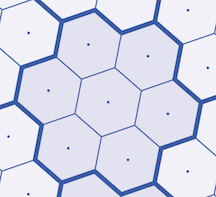
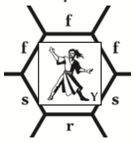

# Combat and Movement Guide

---

## CORE CONCEPTS

### Attributes

| Attribute       | Abbreviation | Governs |
|-----------------|--------------|---------|
| **Strength**    | ST           | Hit points, fatigue pool, carrying capacity |
| **Dexterity**   | DX           | Action order, success rolls, base movement, avoiding mishaps |
| **Intelligence** | IQ          | Number of skills/spells known, resistance to mental effects |
| **Wisdom**      | WIS          | Number of skills/spells known, resistance to mental effects |

---

## THE TURN

A turn represents approximately **five seconds** of action. Nothing happens simultaneously—each movement and action can affect what follows.

### Turn Sequence

| Phase | Name | Description |
|-------|------|-------------|
| 1 | **Initiative** | Each side rolls 1 die. Winner chooses to move first or second. |
| 2 | **Renew Spells** | Pay ST to maintain continuing spells. Unrenewed spells end before movement. |
| 3 | **First Movement** | First player moves all figures. Movement stops upon engagement. |
| 4 | **Second Movement** | Second player moves all figures. Additional players move in initiative order. |
| 5 | **Actions** | All figures act in adjDX order (highest first). One action per figure. |
| 6 | **Forced Retreat** | Figures that dealt physical hits and took none may push enemies back 1 hex. |

---

## MOVEMENT

### Hex Size

A hex is approximately **4 feet (1.3 meters)** across—roughly the space one combatant controls in melee.

### Megahex

A **megahex** is a cluster of 7 hexes: 1 center hex surrounded by 6 adjacent hexes. Megahexes are used for measuring missile range.

### Base Movement Allowance

**MA = DX − 2** (minimum 4)

| DX | Base MA |
|----|---------|
| 8  | 6 |
| 9  | 7 |
| 10 | 8 |
| 11 | 9 |
| 12 | 10 |
| 13 | 11 |
| 14 | 12 |

### Encumbrance

Encumbrance is based on weight carried compared to ST.

| Load Level | Weight Carried | MA Modifier | Restrictions |
|------------|----------------|-------------|--------------|
| Unencumbered | Up to ST lbs | 0 | — |
| Light | ST+1 to ST×1.5 lbs | −1 | — |
| Medium | ST×1.5+1 to ST×2 lbs | −2 | Cannot Run |
| Heavy | ST×2+1 to ST×2.5 lbs | −4 | Cannot Run or Jog |
| Overloaded | Over ST×2.5 lbs | Walk only, 1 hex max | — |

**Dropping a Pack:** Free action at the start of your movement. Recalculate encumbrance immediately. Picking up and securing a dropped pack takes one full turn (no other actions).

### Movement Speeds

| Speed | Distance | Fatigue Cost | Available Actions |
|-------|----------|--------------|-------------------|
| **Run** | Full MA | 1 per turn | None (movement only) |
| **Jog** | Half MA | None (combat) / 1 per 10 min (travel) | Charge Attack, Dodge, Drop prone |
| **Walk** | Up to 2 hexes | None | Ready Weapon |
| **Walk (slow)** | Up to 1 hex | None | Cast Spell, Missile Attack, Disbelieve |
| **Stand Still** | 0 | None | Stand Up, Pick Up Weapon |

**Engaged figures** can only Shift (1 hex, stay adjacent) or Stand Still. Running and Jogging require being disengaged.

### Fatigue

**Fatigue Pool = ST**

| Activity | Fatigue Cost |
|----------|--------------|
| Running | 1 per turn |
| Jogging (combat) | None |
| Jogging (travel) | 1 per 10 minutes |
| Walking | None |
| Walking (travel) | Recover 1 per hour |
| Resting | Recover 1 per 10 minutes |

**Exhaustion:** When fatigue spent equals ST, you are **exhausted**:

- MA halved (round down)
- −2 DX on all rolls
- Cannot Run
- Must rest to recover

**Collapse:** If forced to spend fatigue beyond ST (e.g., spell casting, forced march), make a 3-dice save vs. ST or fall unconscious.

### Facing

Each figure faces one hex side. This determines front, side, and rear hexes.

- **Physical attacks:** Only into your front hexes
- **Spells:** Your hex, adjacent hexes, or any hex "in front" of you
- **Prone/crawling figures:** All hexes count as rear (except for spell-casting direction)

### Engagement

| Figure Type | Engaged When... |
|-------------|-----------------|
| One-hex figure | In an armed enemy's front hex |
| 3–6 hex figure | In front hexes of 2+ one-hex figures (or 1 multi-hex figure) |
| 7-hex figure | In front hexes of 3+ one-hex figures (or 1 multi-hex figure) |

- Figures **stop immediately** when they become engaged
- Multi-hex figures can push back smaller figures (combined ST of smaller figures must be less than pusher's ST)

---

## ACTIONS

A figure may execute **one option** each turn, may not mix actions from different options, and may have different options depending on whether it is engaged, disengaged, or in HTH when its turn to move comes. During a turn, a player may change their mind about a figure's option, if that figure has not yet acted, and that figure did not move too far to allow taking the new option.

### Movement Limits Summary

| Max Movement | Speed | Fatigue | Available Actions |
|--------------|-------|---------|-------------------|
| Full MA | Run | 1/turn | Movement only (a) |
| Half MA | Jog | None | Charge Attack, Dodge, Drop (b, c, d) |
| 2 hexes | Walk | None | Ready New Weapon (e) |
| 1 hex | Walk (slow) | None | Missile Attack, Cast Spell, Disbelieve (f, h, i) |
| 0 | Stand Still | None | Stand Up (g) |

### Options for Disengaged Figures

| Option | Name | Description |
|--------|------|-------------|
| (a) | **MOVE** | Move up to full MA. No other action. Costs 1 fatigue per turn. |
| (b) | **CHARGE ATTACK** | Move up to ½ MA and attack with any weapon except a missile weapon, or HTH. (A figure can never attack if it moved more than ½ MA.) |
| (c) | **DODGE** | Move up to ½ MA while dodging. +1 die on to-hit roll if attacked by thrown weapons, missile weapons, or missile spells during turn. |
| (d) | **DROP** | Move up to ½ MA and drop to a prone or kneeling position. |
| (e) | **READY NEW WEAPON** | Move up to 2 hexes, re-sling (not drop) ready weapon and/or shield, and ready a new weapon and/or shield, or pick up and ready a dropped weapon and/or shield in the hex where movement ends or an adjacent hex. |
| (f) | **MISSILE WEAPON ATTACK** | Move up to 1 hex and/or drop to prone/kneeling position and/or fire a missile weapon. |
| (g) | **STAND UP** | Rise from prone, kneeling, or knocked-down position during the action phase, or crawl 2 hexes; take no other action. A figure must take a turn to stand up before attacking, running, etc. |
| (h) | **CAST SPELL** | Move 1 hex or stand still, and attempt any spell. |
| (i) | **DISBELIEVE** | Move 1 hex or stand still, taking no other action, and attempt to disbelieve one figure. |

### Options for Engaged Figures

| Option | Name | Description |
|--------|------|-------------|
| (j) | **SHIFT AND ATTACK** | Shift 1 hex (or stand still) and attack with any non-missile weapon. |
| (k) | **SHIFT AND DEFEND** | Shift 1 hex (or stand still) and defend. +1 die on to-hit roll by thrown weapons or regular "melee" attacks. |
| (l) | **ONE-LAST-SHOT MISSILE ATTACK** | If the figure had a missile weapon ready before it was engaged, it may get off one last shot. |
| (m) | **CHANGE WEAPONS** | Shift 1 hex (or stand still) and drop ready weapon (if any), and ready a new non-missile weapon. (An engaged figure cannot ready or reload a missile weapon.) |
| (n) | **DISENGAGE** | Shift 1 hex or stand still during movement. Move 1 hex in any direction instead of attacking when turn to attack comes. |
| (o) | **ATTEMPT HAND-TO-HAND ATTACK** | During movement phase, the figure stands still or shifts; when its turn to attack comes, it moves onto the hex of any adjacent enemy, and attempts to hit with bare hands or a ready dagger. |
| (p) | **STAND UP** | Same as (g) under disengaged figures. |
| (q) | **PICK UP DROPPED WEAPON** | "Bend over" (not moving), drop your ready weapon and/or shield; pick up and ready a dropped weapon in your hex or an adjacent hex. |
| (r) | **CAST SPELL** | Shift 1 hex or stand still, and attempt any spell. |
| (s) | **DISBELIEVE** | Same as (i) above under disengaged figures. |

### Options for Figures in Hand-to-Hand Combat

| Option | Name | Description |
|--------|------|-------------|
| (t) | **HTH ATTACK** | Attempt to hit a foe in the same hex with bare hands or, if dagger is ready, with the dagger. |
| (u) | **ATTEMPT TO DRAW DAGGER** | Requires successful 3/DX roll. |
| (v) | **ATTEMPT TO DISENGAGE** | Roll 4/DX. If successful, immediately stand up and move to any adjacent empty hex. Take no other action this turn. |

### Action Options Summary

| State | Options Available |
|-------|-------------------|
| Disengaged | a, b, c, d, e, f, g, h, i |
| Engaged | j, k, l, m, n, o, p, q, r, s |
| Hand-to-Hand | t, u, v |

---

## ROLLING TO HIT

Roll **3 dice** and try to get your **adjusted DX or less**.

### Automatic Results

| Roll | Result |
|------|--------|
| 3 | Automatic hit, **triple** damage/effect |
| 4 | Automatic hit, **double** damage/effect |
| 5 | Automatic hit |
| 16 | Automatic miss |
| 17 | Automatic miss, drop weapon |
| 18 | Automatic miss, break weapon |

### Roll to Miss

When a missile passes through a hex with a friendly figure, roll to miss. Success means the missile continues past.

| Roll | Result |
|------|--------|
| adjDX or less | Successfully missed (missile continues) |
| 14 | Automatic hit |
| 15–16 | Double damage hit |
| 17–18 | Triple damage hit |

---

## DX ADJUSTMENTS

All adjustments are cumulative.

### Positional Advantage (Physical Attacks)

| Situation | Adjustment |
|-----------|------------|
| Striking from enemy's side hex | +2 |
| Striking from enemy's rear hex | +4 |
| Pole-weapon vs. charging opponent (you stood still) | +2 |
| Crossbow fired from prone | +1 |
| Waiting for an opening | +1 (1 turn), +2 (2+ turns) |

### Target Conditions

| Condition | Adjustment |
|-----------|------------|
| Target is invisible | −6 |
| Target is in a shadow hex | −4 |
| Target is a one-hex figure in flight | −4 |
| Target is a giant snake | −3 |
| Target is a multi-hex figure in flight | −1 |

### Your Conditions

| Condition | Adjustment |
|-----------|------------|
| In shadow hex or firing through shadow | −6 |
| Two-weapon fighting | −4 on both attacks |
| Sweeping blow (attacks all 3 front hexes) | −4 |
| Standing in fire | −2 |
| Standing on a body | −2 |
| Moving over broken ground | −2 |
| Took 5+ hits last turn | −2 |
| Exhausted | −2 |
| Knocked down last turn | No action except stand/crawl |

### Range Adjustments

**Thrown Weapons:** −1 per hex to target

**Missile Weapons:**

| Range (Megahexes) | Adjustment |
|-------------------|------------|
| 0–2 MH | 0 |
| 3–4 MH | −1 |
| 5–6 MH | −2 |
| 7–8 MH | −3 |
| (pattern continues) | −1 per 2 MH |

### Armor and Shield Adjustments

| Equipment | Adjustment |
|-----------|------------|
| Small or spike shield | 0 |
| Large shield | −1 |
| Tower shield | −2 |
| Cloth armor | −1 |
| Leather armor | −2 |
| Chainmail | −3 |
| Half-plate armor | −4 |
| Plate armor | −5 |

---

## DAMAGE AND PROTECTION

### Dealing Damage

After hitting, roll damage dice. Notation examples:

- **2 dice** = roll 2d6
- **1+1** = roll 1d6, add 1
- **2−2** = roll 2d6, subtract 2

### Protection

Armor and natural protection subtract hits **from each attack**.

### Injury Effects

| Condition | Effect |
|-----------|--------|
| ST reduced to 3 or less | −3 DX for rest of combat |
| ST reduced to 1 | Unconscious |
| ST reduced to 0 | Dead |
| Took 5+ hits in one turn | −2 DX next turn |
| Took 8+ hits in one turn | Fall down immediately, lose action this turn |

**For figures with ST 30–49:** 9+ hits = −2 DX; 16+ hits = fall down

**For figures with ST 50+:** 15+ hits = −2 DX; 25+ hits = fall down

---

## SPECIAL SITUATIONS

### Disengaging

**From Engaged (option n):**

- Shift 1 hex or stand still during movement phase
- Move 1 hex in any direction instead of attacking when your turn to attack comes
- Faster enemies (higher adjDX) can still strike you
- Slower enemies attack at penalty = difference in adjDX

**From Hand-to-Hand (option v):**

- Roll 4/DX
- If successful, immediately stand up and move to any adjacent empty hex
- Take no other action this turn
- If not successful, remain in HTH

### Hand-to-Hand Combat

A figure may move into an enemy figure's hex, initiating HTH combat, if:

- Enemy has their back to the wall; or
- Enemy is down, prone, or kneeling; or
- Enemy has a lower MA; or
- The attacker comes in from the rear; or
- The enemy agrees to HTH combat

**Initiating HTH combat is considered an attack.** Figures in HTH combat always get the +4 "rear hex" DX adjustment.

**Defense Against HTH Attack** (roll 1 die):

| Roll | Result |
|------|--------|
| 1–2 | Defender drops ready weapon and/or shield (unless dagger) and fights bare-handed. Both figures fall to the ground. |
| 3–4 | Defender drops ready weapon and/or shield, but has time to ready a dagger (if carried). Both figures fall to the ground. |
| 5 | Defender does not drop ready weapon. Attacker immediately backs up to the hex from which they entered. HTH does not take place. |
| 6 | Defender does not drop ready weapon and automatically hits the attacker. Attacker must retreat one hex. HTH does not take place. (If attacker jumped from rear, or defender is unarmed, ignore 6 and roll again.) |

**Bare-Handed Damage by ST:**

| ST | Damage | ST | Damage |
|----|--------|----|--------|
| 8 or less | 1d−4 | 17–20 | 1d+1 |
| 9–10 | 1d−3 | 21–24 | 1d+2 |
| 11–12 | 1d−2 | 25–30 | 1d+3 |
| 13–14 | 1d−1 | 31–40 | 2d+1 |
| 15–16 | 1d | 41–50 | 3d+1 |

**Weapon bonuses in HTH:** Dagger/Cestus +3 hits; Club (one-handed) +3 hits; Club (two-handed) +4 hits

### Defending and Dodging

| Action | Usable By | Defends Against | Effect |
|--------|-----------|-----------------|--------|
| Dodge | Disengaged figures | Missiles and thrown weapons only | Attacker rolls 4 dice |
| Defend | Engaged figures | Melee and non-missile attacks only | Attacker rolls 4 dice |

**4-Dice Special Results:** 4–5 auto-hit; 20+ auto-miss; 21–22 drop weapon; 23–24 break weapon

### Forced Retreat

If you dealt physical hits and took none:

1. Push enemy back 1 hex in any direction
2. Choose to advance into vacated hex or stand still
3. If enemy has no hex to retreat to, they roll 3 dice vs. DX or fall

### Crawling and Prone

- Crawling MA = 2
- Crawling/prone figures have all rear hexes (cannot attack)
- Prone behind a body: missiles may hit the body instead (roll 1 die; 1–3 hits body if target prone, 1–4 if kneeling)

### Flight

- Half flying MA on takeoff turn
- Cannot move on landing turn
- Fliers don't engage ground figures unless they choose to
- Two fliers can pass at "different heights" if both agree

---

## QUICK REFERENCE SUMMARY

### Turn Order

1. Initiative (roll off, winner picks move order)
2. Renew Spells
3. Movement (by side, in initiative order)
4. Actions (by individual adjDX, highest first)
5. Forced Retreat
6. Post-Turn Damage

### Key Numbers

| Situation | Roll |
|-----------|------|
| To hit | 3 dice ≤ adjDX |
| Defending/Dodging target | 4 dice ≤ adjDX |
| Saving roll | 3 dice ≤ attribute (usually DX or IQ) |
| Auto-hit | 3, 4, or 5 |
| Auto-miss | 16, 17, or 18 |

### Movement Quick Reference

| DX | Base MA | Run (Full) | Jog (Half) |
|----|---------|------------|------------|
| 8  | 6 | 6 hexes | 3 hexes |
| 10 | 8 | 8 hexes | 4 hexes |
| 12 | 10 | 10 hexes | 5 hexes |
| 14 | 12 | 12 hexes | 6 hexes |

### Encumbrance Quick Reference

| Load | Weight | MA Mod | Can Run? | Can Jog? |
|------|--------|--------|----------|----------|
| Unencumbered | ≤ ST | 0 | Yes | Yes |
| Light | ≤ ST×1.5 | −1 | Yes | Yes |
| Medium | ≤ ST×2 | −2 | No | Yes |
| Heavy | ≤ ST×2.5 | −4 | No | No |
| Overloaded | > ST×2.5 | Walk only | No | No |

### Fatigue Quick Reference

| Activity | Cost |
|----------|------|
| Run | 1 per turn |
| Jog (combat) | None |
| Jog (travel) | 1 per 10 min |
| Walk | None |
| Rest | Recover 1 per 10 min |
| Exhausted | −2 DX, half MA, no running |

### Action Options Quick Reference

| State | Options |
|-------|---------|
| **Disengaged** | (a) Move, (b) Charge Attack, (c) Dodge, (d) Drop, (e) Ready Weapon, (f) Missile Attack, (g) Stand Up, (h) Cast Spell, (i) Disbelieve |
| **Engaged** | (j) Shift & Attack, (k) Shift & Defend, (l) Last Shot, (m) Change Weapons, (n) Disengage, (o) Attempt HTH, (p) Stand Up, (q) Pick Up Weapon, (r) Cast Spell, (s) Disbelieve |
| **HTH** | (t) HTH Attack, (u) Draw Dagger, (v) Disengage |
